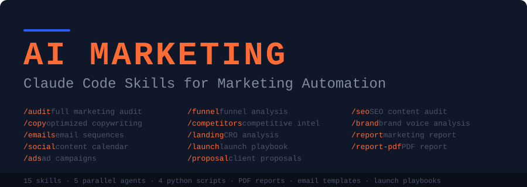

<div align="center">



<br/>
<br/>

# Suite Marketing IA · Agents Claude Code

### Analysez n'importe quel site web et générez vos contenus marketing depuis le terminal — en français, pour le marché européen.

<br/>

[](LICENSE)
[](https://docs.anthropic.com/en/docs/claude-code)
[](https://python.org)
[](https://github.com/ASMAE-DEV-SE/claude-agents-marketing-eu)

<br/>

**[Installation](#-installation)** · **[Commandes](#-commandes)** · **[Comment ça marche](#-comment-ça-marche)** · **[Architecture](#️-architecture)** · **[Scoring](#-scoring)**

</div>

---

## C'est quoi exactement ?

Ce projet est un **système de skills et d'agents IA** qui s'installe dans [Claude Code](https://docs.anthropic.com/en/docs/claude-code) et vous permet d'analyser des sites web réels, générer du contenu marketing et produire des rapports en Markdown ou PDF — directement depuis votre terminal.

**Ce que ça fait concrètement :**
- Un script Python (`analyze_page.py`) récupère et parse le vrai HTML de n'importe quel site
- 5 agents IA se lancent **en parallèle** et analysent chacun une dimension différente du site
- Les rapports sont rédigés **en français**, avec une attention particulière aux obligations du marché européen (RGPD, droit de rétractation 14 jours, TVA intracommunautaire)
- Chaque rapport est sauvegardé dans un fichier Markdown ou PDF dans votre répertoire courant

**Ce que ça n'est pas :** un générateur de contenu générique. Chaque analyse s'appuie sur le contenu réel du site ciblé, récupéré au moment de l'exécution.

---

## Prérequis

- [Claude Code](https://docs.anthropic.com/en/docs/claude-code) installé et configuré
- Python 3.8 ou supérieur
- `pip install reportlab` *(uniquement si vous voulez l'export PDF)*

---

## 🚀 Installation

### Une seule commande

```bash
curl -fsSL https://raw.githubusercontent.com/ASMAE-DEV-SE/claude-agents-marketing-eu/main/install.sh | bash
```

### Manuelle

```bash
git clone https://github.com/ASMAE-DEV-SE/claude-agents-marketing-eu.git
cd claude-agents-marketing-eu
./install.sh
```

Le script copie les skills dans `~/.claude/skills/` et les agents dans `~/.claude/agents/`.

---

## Exemple en action

> *Les scores ci-dessous sont illustratifs. Les vrais résultats dépendent du site analysé.*

```
/market audit https://exemple.fr

Lancement de 5 agents en parallèle...

  ✓ Contenu & Messaging      
  ✓ Optimisation des Conversions 
  ✓ SEO & Visibilité  
  ✓ Positionnement Concurrentiel 
  ✓ Marque & Confiance    
  ✓ Croissance & Stratégie 

  Score Marketing Global : [moyenne pondérée / 100]

  Rapport complet → MARKETING-AUDIT.md
```

---

## ⚡ Commandes

| Commande | Ce que ça produit | Fichier généré |
|:---------|:------------------|:---------------|
| `/market audit <url>` | Audit complet — 5 agents IA en parallèle | `MARKETING-AUDIT.md` |
| `/market quick <url>` | Bilan express en moins de 60 secondes, terminal uniquement | — |
| `/market copy <url>` | Suggestions de copies avec exemples avant / après | `COPY-SUGGESTIONS.md` |
| `/market emails <sujet>` | Séquences d'emails générées par IA | `EMAIL-SEQUENCES.md` |
| `/market social <sujet>` | Calendrier éditorial réseaux sociaux sur 30 jours | `SOCIAL-CALENDAR.md` |
| `/market ads <url>` | Textes publicitaires pour différentes plateformes | `AD-CAMPAIGNS.md` |
| `/market funnel <url>` | Analyse du tunnel de vente et points de friction | `FUNNEL-ANALYSIS.md` |
| `/market competitors <url>` | Rapport de positionnement concurrentiel | `COMPETITOR-REPORT.md` |
| `/market landing <url>` | Analyse CRO de page d'atterrissage | `LANDING-CRO.md` |
| `/market launch <produit>` | Plan de lancement structuré | `LAUNCH-PLAYBOOK.md` |
| `/market proposal <client>` | Proposition commerciale à personnaliser | `CLIENT-PROPOSAL.md` |
| `/market report <url>` | Rapport marketing complet en Markdown | `MARKETING-REPORT.md` |
| `/market report-pdf <url>` | Rapport marketing en PDF *(nécessite reportlab)* | `MARKETING-REPORT.pdf` |
| `/market seo <url>` | Audit SEO on-page et technique | `SEO-AUDIT.md` |
| `/market brand <url>` | Analyse de la voix de marque | `BRAND-VOICE.md` |

---

## Comment ça marche

```
Vous tapez /market audit https://exemple.fr
            │
            ▼
  Claude lit market/SKILL.md       ← fichier d'instructions de routage
            │
            ▼
  Python analyze_page.py           ← récupère et parse le vrai HTML du site
            │
  ┌─────────┼───────────────┐
  ▼         ▼               ▼  (5 agents en parallèle via Claude Code)
Contenu   CRO & tunnel   SEO tech   Concurrence   Stratégie & marque
  │         │               │            │               │
  └─────────┴───────────────┴────────────┴───────────────┘
            │
            ▼
  Compilation + scoring pondéré (voir section Scoring)
            │
            ▼
  MARKETING-AUDIT.md  — rapport structuré en français
```

### Ce que `analyze_page.py` extrait réellement

Le script utilise uniquement la bibliothèque standard Python (pas de dépendances externes) et extrait depuis le HTML brut :

| Catégorie | Données extraites |
|:----------|:------------------|
| **SEO** | Balise `<title>`, meta description, hiérarchie H1–H6, images sans attribut `alt`, balise canonical, viewport, Open Graph |
| **Conversion** | CTAs détectés (liens + boutons), formulaires (nombre de champs, méthode GET/POST) |
| **Confiance** | Liens réseaux sociaux, schémas JSON-LD |
| **Tracking** | Google Analytics / GTM, Meta Pixel, Hotjar, HubSpot, Intercom, TikTok Pixel, Microsoft Clarity, et autres |
| **Technique** | Présence de `robots.txt`, `sitemap.xml`, liens internes vs externes, nombre de scripts |

### Adaptation au marché européen

Les agents sont instruits pour adapter leur analyse au type d'activité détecté :

| Type d'activité | Points d'attention spécifiques |
|:----------------|:-------------------------------|
| E-commerce | Droit de rétractation 14 jours *(obligation légale UE)*, politique de retour, sécurité du paiement |
| SaaS | Conversion essai gratuit → abonnement, onboarding, paliers de tarification |
| Agence / Services | Études de cas, formulaire de contact, mentions légales |
| E-commerce transfrontalier | TVA intracommunautaire, balises `hreflang`, TLDs par pays |
| Commerce local | Google Business Profile, Pages Jaunes, avis Trustpilot / Avis Vérifiés |

---

## 📊 Scoring

L'audit évalue 6 dimensions. Les poids ci-dessous sont ceux définis dans `market/SKILL.md` :

| Dimension | Poids défini | Ce qui est évalué |
|:----------|:------------:|:------------------|
| Contenu & Messaging | **25%** | Clarté du titre, proposition de valeur, textes, CTAs |
| Optimisation des Conversions | **20%** | Tunnel, formulaires, preuve sociale, friction, urgence |
| SEO & Visibilité | **20%** | SEO on-page, SEO technique, structure du contenu |
| Positionnement Concurrentiel | **15%** | Différenciation, connaissance du marché |
| Marque & Confiance | **10%** | Design, signaux de confiance, mentions légales |
| Croissance & Stratégie | **10%** | Tarification, canaux d'acquisition, rétention |

> Le score global est la moyenne pondérée de ces 6 dimensions. L'évaluation de chaque dimension est réalisée par un agent IA sur la base du contenu réel du site — elle comporte donc une part de jugement qualitatif.

Chaque recommandation est classée par niveau d'impact : **Élevé / Moyen / Faible**.

---

## 🏗️ Architecture

```
claude-agents-marketing-eu/
│
├── market/SKILL.md                  ← Orchestrateur — route toutes les commandes /market
│
├── skills/                          ← 14 sous-skills (un par commande)
│   ├── market-audit/SKILL.md
│   ├── market-copy/SKILL.md
│   ├── market-emails/SKILL.md
│   ├── market-social/SKILL.md
│   ├── market-ads/SKILL.md
│   ├── market-funnel/SKILL.md
│   ├── market-competitors/SKILL.md
│   ├── market-landing/SKILL.md
│   ├── market-launch/SKILL.md
│   ├── market-proposal/SKILL.md
│   ├── market-report/SKILL.md
│   ├── market-report-pdf/SKILL.md
│   ├── market-seo/SKILL.md
│   └── market-brand/SKILL.md
│
├── agents/                          ← 5 agents lancés en parallèle lors d'un /market audit
│   ├── market-content.md            ← Contenu & Messaging
│   ├── market-conversion.md         ← CRO & tunnel de vente
│   ├── market-competitive.md        ← Positionnement concurrentiel
│   ├── market-technical.md          ← SEO technique & tracking
│   └── market-strategy.md           ← Marque, pricing & croissance
│
├── scripts/                         ← Scripts Python (stdlib uniquement)
│   ├── analyze_page.py              ← Parser HTML — point d'entrée de l'analyse
│   ├── competitor_scanner.py        ← Scanner de sites concurrents
│   ├── social_calendar.py           ← Générateur de calendrier éditorial
│   └── generate_pdf_report.py       ← Export PDF (nécessite reportlab)
│
├── templates/                       ← Modèles de départ utilisés par les agents
│   ├── email-welcome.md             ← Séquence d'accueil (5 emails)
│   ├── email-nurture.md             ← Nurturing leads (6 emails)
│   ├── email-launch.md              ← Lancement produit (8 emails)
│   ├── proposal-template.md         ← Proposition commerciale
│   ├── content-calendar.md          ← Calendrier 30 jours
│   └── launch-checklist.md          ← Checklist de lancement
│
├── install.sh
├── uninstall.sh
├── requirements.txt                 ← reportlab uniquement (optionnel)
└── LICENSE
```

---

## Cas d'usage

**Agences et freelances**
Auditez le site d'un prospect avec `/market audit` avant un rendez-vous. Générez une proposition avec `/market proposal`. Exportez un rapport avec `/market report-pdf`.

**Solopreneurs**
Analysez votre propre site avec `/market copy`, préparez un lancement avec `/market launch`, créez vos séquences emails avec `/market emails`.

**Créateurs de contenu**
Planifiez votre contenu avec `/market social`, étudiez vos concurrents avec `/market competitors`, vérifiez votre SEO avec `/market seo`.

---

## Désinstallation

```bash
./uninstall.sh
```

Ou manuellement :

```bash
rm -rf ~/.claude/skills/market*
rm -f ~/.claude/agents/market-*.md
```

---

## Licence

MIT — voir [LICENSE](LICENSE)

---

<div align="center">

Conçu pour le marché francophone et européen · Tous les rapports sont générés en français

</div>
